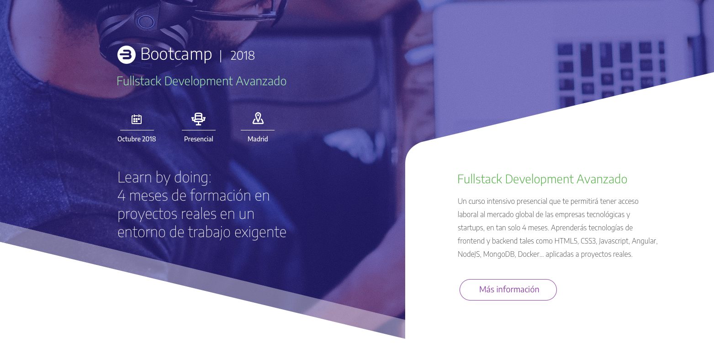

# Aplicamos Sass/SCSS

Maquetar el diseño disponible en [Zeplin](https://app.zeplin.io/projects) aplicando los conocimientos Sass:

- Anidamiento de selectores.
- Referencia al selector padre.
- Comentarios no visibles en el fichero CSS.

## Variables Sass a utilizar

Paleta de colores:

```
$white:         #fff
$green:         #5db250
$green-light:   #9de7ac
$gray-dark:     #323232
#purple:        #8c40a3
```

Tamaño de texto:

```
$font-size-base:  16px
$font-size-sm:    14px
$font-size-md:    18px
$font-size-lg:    26px
$font-size-xl:    36px
```

Por otro lado, crear las variables para los 3 breakpoints indicados a continuación considerando que cada varibale ha de contener la expresión completa de la _media query_.

- Tablet: `768px`
- Desktop: `1024px`
- Desktop HD: `1260px`

## Custom properties

El diseño es responsive y haremos uso de las **custom properties** para modificar el aspecto de los elementos en los diferentes _breakpoints_.

Muestra del diseño a maquetar (versión Desktop):


